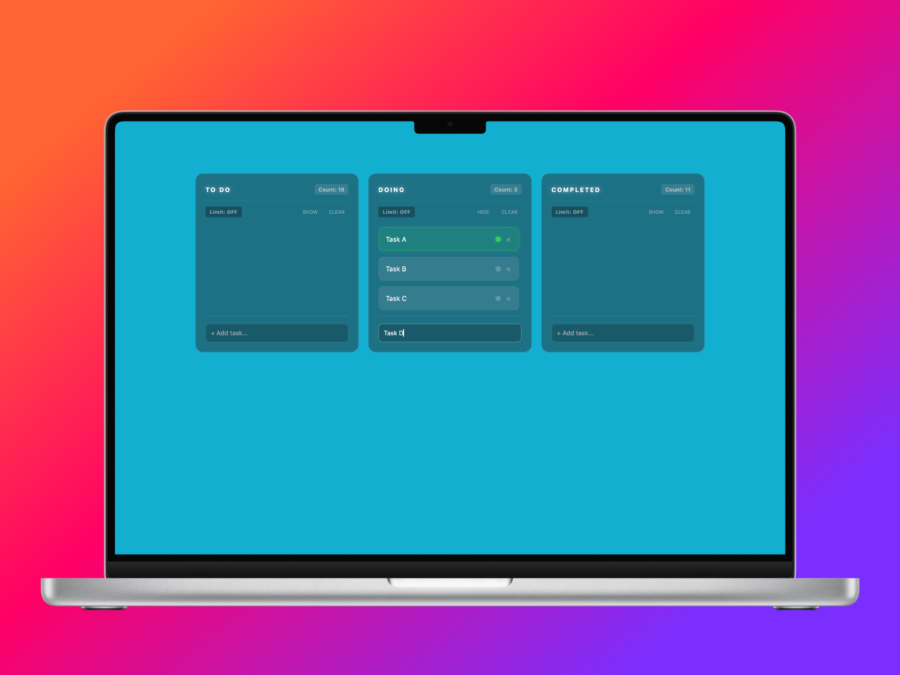

# Übersicht Modern Kanban

> A fully interactive Kanban board widget for Übersicht — manage tasks directly on your macOS desktop with drag-and-drop, WIP limits, and persistent state.

<!--  -->
<!--  -->

<!--  -->

[](https://github.com/srjoy5000/ubersicht-interactive-to-do/stargazers)



---

## Key Features

- **Three-column board** — To Do, Doing, and Done columns out of the box
- **Full task CRUD** — add tasks, double-click to edit in place, delete with one click
- **Drag-and-drop** — reorder tasks within a column or move them between columns
- **Active task mode** — highlight one task in the Doing column as your current focus
- **WIP limits** — configurable per-column task caps, toggleable at any time
- **Column visibility** — collapse individual columns to reduce clutter
- **Clear column** — bulk-delete all tasks in a column in one action
- **Persistent state** — all tasks and settings survive page reloads via `localStorage`
- **Glass-morphism UI** — dark, blurred backdrop with green accents that blends into any desktop wallpaper

## Tech Stack

<p align="left">
  <a href="https://skillicons.dev">
    
  </a>
</p>

| Category        | Details                                                                        |
| :-------------- | :----------------------------------------------------------------------------- |
| **Runtime**     | [Übersicht](https://tracesof.net/uebersicht/) (macOS desktop widget framework) |
| **UI**          | React (built into Übersicht — no separate install needed)                      |
| **Language**    | JavaScript / JSX                                                               |
| **Styling**     | CSS with `backdrop-filter` blur and CSS animations                             |
| **Persistence** | Browser `localStorage`                                                         |

No build step, no package manager, no external dependencies.

---

## Project Structure

```
interactive-kanban-app/
├── index.jsx       # All state logic, reducer, components, and styles
├── images/
│   └── kanban-board.png
├── TODO.md         # Upcoming features and known issues
└── README.md
```

## Quick Start

### Prerequisites

- macOS with [Übersicht](https://tracesof.net/uebersicht/) installed

### Setup

1. **Clone the repo into Übersicht's widgets directory:**

   ```bash
   git clone git@github.com:srjoy5000/ubersicht-interactive-to-do.git \
     ~/Library/Application\ Support/Übersicht/widgets/ubersicht-interactive-to-do.git
   ```

2. **Reload Übersicht widgets** — press `⌘R` in the Übersicht menu bar, or go to **Übersicht → Reload All Widgets**.

The board appears on your desktop immediately. No environment variables or configuration required.

---

## License

This project is licensed under the MIT License — see the [LICENSE](LICENSE) file for details.

---

**Developed by [srjoy5000](https://github.com/srjoy5000)**
